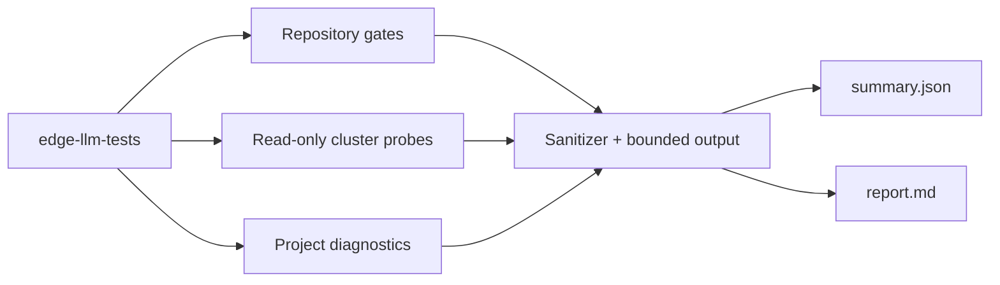

# edge-llm-tests

Go-first validation and sanitized evidence for the
[Edge-Computing-LLM](https://github.com/Edge-Computing-LLM) project family.
The harness checks repository quality, Helm profiles, the local Ubuntu + k3s +
NVIDIA GPU substrate, the deployed observability stack, and the fixed Qwen
runtime smoke contract from one reproducible command.

The project is an evidence plane, not a deployment layer. It does not install,
repair, upgrade, or remove host packages, k3s, Helm releases, models, or
workloads. A failing live check is preserved as a finding so operators can act
through the owning repository.

## Coverage

| Scope | What is tested |
|---|---|
| `edge-cli` | module integrity, formatting, unit/race tests, vet, vulnerability scan, build, read-only infrastructure validation |
| `k3s-nvidia-edge` | module integrity, formatting, unit/race tests, vet, vulnerability scan, build, Helm lint/render, read-only doctor |
| `llm-observability-stack` | module integrity, formatting, unit/race tests, vet, vulnerability scan, three Go builds, Helm dependencies/lint, five render profiles, live doctor |
| `qwen-gguf-observability` | module integrity, formatting, unit/race tests, vet, vulnerability scan, build, live contract validation, fixed smoke probe |
| Local platform | Ubuntu/kernel/tool versions, NVIDIA GPU, node readiness, RuntimeClass, GPU resource, workloads, releases, and storage |
| Dashboard candidates | existing Git integrity plus available lint/test/build scripts; dependencies are never installed or changed |

Credential stores, model weights, backups, downloaded archives, and large-file
collections are explicitly outside the inventory boundary.

## Quick start

Requirements: Go 1.25+, Git, Helm, `kubectl`, a configured local k3s context,
and `nvidia-smi`. From this repository:

```bash
go run ./cmd/edge-llm-tests -mode all -root ..
```

Useful focused runs:

```bash
go run ./cmd/edge-llm-tests -mode repository -root ..
go run ./cmd/edge-llm-tests -mode cluster -root ..
go run ./cmd/edge-llm-tests -mode repository -root .. -include-candidates=false
go run ./cmd/edge-llm-tests -mode all -root .. -output results/manual-run
```

The process exits `0` when every required check passes, `1` when findings are
recorded, and `2` for invalid configuration or an evidence-write error.

## Results

Each run creates a UTC-stamped directory under `results/`:

```text
results/20260719T120000Z/
├── report.md       human-readable outcome and bounded failure details
├── summary.json    versioned machine-readable evidence
└── qwen-smoke.json privacy-safe smoke metadata, when the probe runs
```

Result files are intentionally suitable for source control. Commands and
bounded output pass through the sanitizer. The Qwen artifact records only the
model identifier, observation time, duration, and pass state; the prompt and
model response are never stored. See [the evidence policy](docs/EVIDENCE-POLICY.md).

## Design

The executable uses only the Go standard library. It delegates project-native
tests to Go, Git, Helm, Kubernetes, and NVIDIA command-line tools already on the
host. No runtime package manager or shell lifecycle script is required.



For the detailed mapping, read [TEST-MATRIX.md](docs/TEST-MATRIX.md). For local
operating assumptions and interpretation, read
[LOCAL-VALIDATION.md](docs/LOCAL-VALIDATION.md).

## Develop

```bash
gofmt -w ./cmd ./internal
go test ./...
go test -race ./...
go vet ./...
go build -o bin/edge-llm-tests ./cmd/edge-llm-tests
```

Contributions must keep cluster probes read-only and evidence sanitized. See
[CONTRIBUTING.md](CONTRIBUTING.md), [SECURITY.md](SECURITY.md), and
[AGENTS.md](AGENTS.md).

## License

MIT — see [LICENSE](LICENSE).
